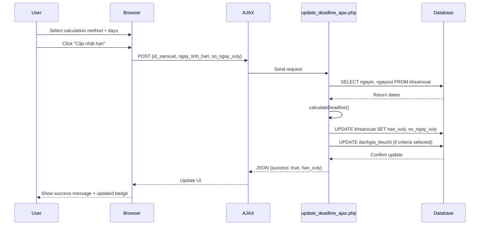
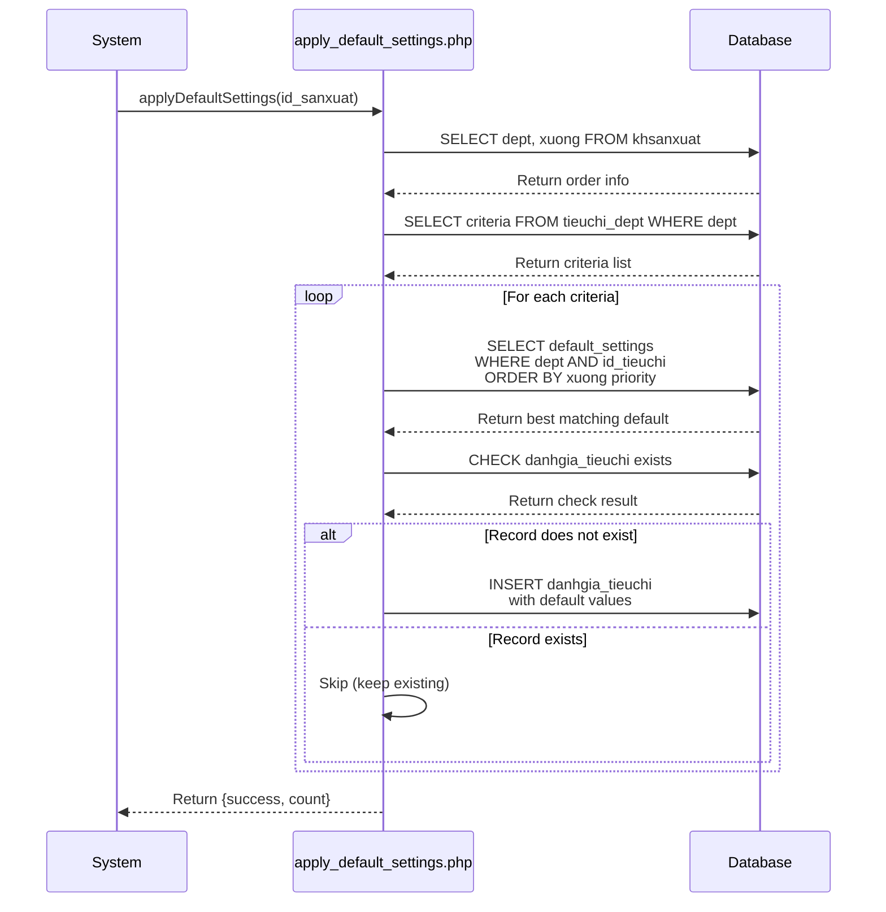
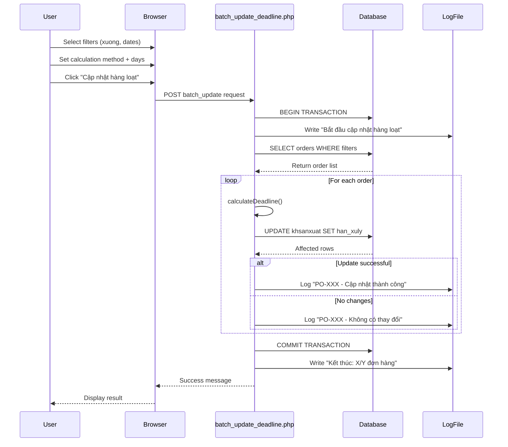

# Deadline Management System - Technical Design

## Architecture Overview

The Deadline Management System is a PHP-based module that calculates, stores, and displays processing deadlines for production orders and their evaluation criteria. It supports hierarchical default settings, multiple calculation methods, and real-time AJAX updates.

---

## System Components

### Core Calculation Engine

**File**: `display_deadline.php:275-350`

**Function**: `calculateDeadline($ngay_vao, $ngay_ra, $ngay_tinh_han, $so_ngay_xuly)`

**Logic Flow**:
```
1. Validate: ngay_vao must exist (return null if empty)
2. Parse dates: Convert ngay_vao and ngay_ra to DateTime objects
3. Switch on ngay_tinh_han:
   - 'ngay_vao': deadline = ngay_vao - so_ngay_xuly days
   - 'ngay_vao_cong': deadline = ngay_vao + so_ngay_xuly days
   - 'ngay_ra': deadline = ngay_ra (or ngay_vao + 7 if missing)
   - 'ngay_ra_tru': deadline = ngay_ra - so_ngay_xuly days
   - default: deadline = ngay_vao + so_ngay_xuly days
4. Return: Y-m-d formatted date string
```

**Error Handling**:
- Returns `null` if ngay_vao is empty
- Catches DateTime exceptions and returns `null`
- Falls back to ngay_vao + 7 days if ngay_ra missing for ra-based methods

---

### Default Settings Management

**Files**: 
- `save_default_settings.php:28-118`
- `apply_default_settings.php:22-180`

**Default Settings Hierarchy**:

```sql
-- Priority 1: Factory-specific + Department + Criteria
SELECT * FROM default_settings 
WHERE dept = ? AND xuong = ? AND id_tieuchi = ?

-- Priority 2: Department + Criteria (xuong = '')
SELECT * FROM default_settings 
WHERE dept = ? AND xuong = '' AND id_tieuchi = ?

-- Implemented in apply_default_settings.php:90-94
ORDER BY CASE WHEN xuong = ? THEN 0 ELSE 1 END LIMIT 1
```

**Save Default Settings Flow**:
```
1. Begin transaction
2. For each criteria in department:
   a. Check if setting exists (dept + id_tieuchi)
   b. If exists: UPDATE so_ngay_xuly, ngay_tinh_han
   c. If not: INSERT new record
3. Commit transaction
4. Return affected_rows count
```

**Apply Defaults to Order**:
```
1. Get order info (dept, xuong) from khsanxuat
2. Get all criteria for department from tieuchi_dept
3. For each criteria:
   a. Query default_settings with priority order
   b. Check if danhgia_tieuchi record exists
   c. If not: INSERT with default values
   d. If exists: Skip (keep existing custom values)
4. Return count of settings applied
```

---

### AJAX Deadline Update

**File**: `update_deadline_ajax.php:1-200`

**Request Parameters**:
- `id_sanxuat`: Order ID (required)
- `ngay_tinh_han`: Calculation method (required)
- `so_ngay_xuly`: Processing days (required)
- `id_tieuchi`: Criteria IDs (optional array)

**Update Flow**:
```
1. Validate parameters
2. Get order dates (ngayin, ngayout) from khsanxuat
3. Calculate new deadline using calculateDeadline()
4. Update khsanxuat: SET han_xuly, so_ngay_xuly, ngay_tinh_han
5. Auto-create ngay_tinh_han column if missing
6. If id_tieuchi provided:
   a. Update each criteria in danhgia_tieuchi
   b. SET han_xuly, so_ngay_xuly, ngay_tinh_han
7. Return JSON: {success, message, han_xuly, affected_rows}
```

**Column Auto-Creation**:
```php
// Check if column exists
$check = mysqli_query($connect, "SHOW COLUMNS FROM danhgia_tieuchi LIKE 'ngay_tinh_han'");
if (mysqli_num_rows($check) == 0) {
    // Add column with default value
    mysqli_query($connect, "ALTER TABLE danhgia_tieuchi 
        ADD COLUMN ngay_tinh_han VARCHAR(20) DEFAULT 'ngay_vao' 
        AFTER so_ngay_xuly");
}
```

See: `update_deadline_ajax.php:148-152`

---

### Batch Update System

**File**: `batch_update_deadline.php:28-168`

**Filter Parameters**:
- `filter_xuong`: Factory filter (optional)
- `filter_start_date`: Entry date >= (optional)
- `filter_end_date`: Entry date <= (optional)
- `ngay_tinh_han`: Calculation method (required)
- `so_ngay_xuly`: Processing days (required)

**Batch Processing Flow**:
```
1. Begin transaction
2. Build WHERE clause with filters:
   - xuong = ? (if provided)
   - ngayin >= ? (if start_date)
   - ngayin <= ? (if end_date)
3. SELECT stt, po, xuong, ngayin, ngayout FROM khsanxuat
4. For each order:
   a. Calculate deadline
   b. UPDATE khsanxuat SET han_xuly, ngay_tinh_han, so_ngay_xuly
   c. Log to update_deadline_batch.log
   d. Increment updated counter
5. Commit transaction
6. Return success message with count
7. On error: Rollback and log failure
```

**Logging Format**:
```
[2026-01-29 10:30:00] Bắt đầu cập nhật hàng loạt
Đơn hàng ID: 123, PO: PO-001 - Cập nhật thành công, hạn xử lý mới: 2025-02-15
Đơn hàng ID: 124, PO: PO-002 - Không có thay đổi
Kết thúc cập nhật: Đã cập nhật thành công 15/20 đơn hàng!
```

See: `batch_update_deadline.php:113-149`

---

### Criteria-Specific Deadline Settings

**Files**:
- Frontend: `settings_deadline.php:1-352`
- Backend: `update_deadline_tieuchi.php:1-180`

**Modal Workflow**:
```
User clicks "Cài đặt hạn" button
  ↓
showDeadlineSettings(id_sanxuat, dept)
  ↓
AJAX GET get_tieuchi_deadline.php
  ↓
Response: {tieuchi: [...], default_settings: {...}}
  ↓
displayTieuchiDeadline() renders table
  ↓
User modifies so_ngay_xuly, ngay_tinh_han
  ↓
Clicks "Lưu" (individual) or "Lưu thay đổi" (all)
  ↓
updateDeadline(id_tieuchi, so_ngay_xuly, ngay_tinh_han, is_default)
  ↓
AJAX POST update_deadline_tieuchi.php
  ↓
Updates danhgia_tieuchi + default_settings (if is_default=true)
```

**Update Deadline Tieuchi Logic**:
```
1. Get order info (ngayin, ngayout, dept, xuong)
2. Calculate deadline using calculateDeadline()
3. UPDATE danhgia_tieuchi:
   - SET han_xuly, so_ngay_xuly, ngay_tinh_han
   - WHERE id_sanxuat AND id_tieuchi
4. If is_default = true:
   a. Check if default_settings exists for dept + id_tieuchi
   b. If exists: UPDATE so_ngay_xuly, ngay_tinh_han
   c. If not: INSERT new default setting
5. Return JSON: {success, message, han_xuly, is_default}
```

See: `update_deadline_tieuchi.php:65-130`

**Bulk Apply Logic**:
```javascript
// Apply same settings to all criteria
$('#btn_apply_all').click(function() {
    var so_ngay_xuly = $('#all_so_ngay_xuly').val();
    var ngay_tinh_han = $('#all_ngay_tinh_han').val();
    
    // Update all input fields
    $('#tieuchi_deadline_settings tr').each(function() {
        $(this).find('.so_ngay_xuly').val(so_ngay_xuly);
        $(this).find('.ngay_tinh_han').val(ngay_tinh_han);
    });
});
```

See: `settings_deadline.php:238-251`

---

### Visual Deadline Indicators

**File**: `display_deadline.php:15-93`

**Function**: `displayDeadlineBadge($han_xuly, $is_custom, $ngay_tinh_han, $so_ngay_xuly)`

**Badge Logic Decision Tree**:
```
Is han_xuly empty?
├─ YES → Grey badge: "Chưa thiết lập"
└─ NO → Calculate days difference
         │
         Is deadline in past (overdue)?
         ├─ YES → Red badge: "Quá hạn X ngày"
         └─ NO → Is deadline < 2 days away?
                  ├─ YES → Yellow badge: "Còn X ngày"
                  └─ NO → Green badge: "Còn X ngày"
```

**Badge CSS Classes**:
- `badge-deadline-none`: Grey (#6c757d)
- `badge-deadline-danger`: Red (#dc3545)
- `badge-deadline-warning`: Yellow (#ffc107)
- `badge-deadline-ok`: Green (#28a745)

**Calculation Method Display Names**:
```php
$methods = [
    'ngay_vao' => 'Ngày vào - X ngày',
    'ngay_vao_cong' => 'Ngày vào + X ngày',
    'ngay_ra' => 'Ngày ra',
    'ngay_ra_tru' => 'Ngày ra - X ngày'
];
```

See: `display_deadline.php:60-78`

**Tooltip Content**:
```html
<span class="badge badge-deadline-ok" 
      data-toggle="tooltip" 
      data-placement="top" 
      data-html="true" 
      title="<b>Hạn xử lý:</b> 25/02/2025<br><b>Cách tính:</b> Ngày vào + 7 ngày">
    ★ ✓ Còn 10 ngày
</span>
```

---

## Database Schema

### default_settings

```sql
CREATE TABLE default_settings (
    id INT AUTO_INCREMENT PRIMARY KEY,
    dept VARCHAR(50) NOT NULL,
    xuong VARCHAR(50) DEFAULT '',
    id_tieuchi INT NOT NULL,
    so_ngay_xuly INT NOT NULL DEFAULT 7,
    ngay_tinh_han VARCHAR(20) DEFAULT 'ngay_vao',
    nguoi_chiu_trachnhiem_default INT,
    INDEX idx_dept_tieuchi (dept, id_tieuchi),
    INDEX idx_xuong (xuong)
);
```

**Hierarchy Logic**:
- `xuong = ''`: Department-wide default (applies to all factories)
- `xuong = 'A'`: Factory-specific default (overrides department default)

See: `apply_default_settings.php:90-94`

### khsanxuat (Order Table)

Relevant columns:
```sql
ALTER TABLE khsanxuat ADD COLUMN han_xuly DATE;
ALTER TABLE khsanxuat ADD COLUMN so_ngay_xuly INT;
ALTER TABLE khsanxuat ADD COLUMN ngay_tinh_han VARCHAR(20);
```

See: `update_deadline.php:99-114`

### danhgia_tieuchi (Criteria Evaluation)

Relevant columns:
```sql
ALTER TABLE danhgia_tieuchi ADD COLUMN han_xuly DATE;
ALTER TABLE danhgia_tieuchi ADD COLUMN so_ngay_xuly INT;
ALTER TABLE danhgia_tieuchi ADD COLUMN ngay_tinh_han VARCHAR(20) DEFAULT 'ngay_vao';
```

**Auto-creation**: System automatically adds `ngay_tinh_han` if missing.

See: `update_deadline_ajax.php:148-152`, `update_deadline_tieuchi.php:46-52`

---

## Sequence Diagrams

### Update Order Deadline (AJAX)



### Apply Default Settings to New Order



### Batch Update Deadlines



---

## Error Handling

### Missing Date Validation

```php
// display_deadline.php:277-278
if (empty($ngay_vao)) {
    return null;
}
```

**Behavior**: Returns null, UI displays "Chưa thiết lập" badge.

### Invalid DateTime

```php
// display_deadline.php:285-289
try {
    $ngay_vao_date = new DateTime($ngay_vao);
} catch (Exception $e) {
    return null;
}
```

**Behavior**: Catches exception, returns null instead of crashing.

### Missing Exit Date Fallback

```php
// display_deadline.php:322-324
if ($ngay_ra_date) {
    $deadline = clone $ngay_ra_date;
} else {
    // Use entry + 7 days as fallback
    $deadline = clone $ngay_vao_date;
    $deadline->add(new DateInterval('P7D'));
}
```

**Behavior**: Automatically falls back to entry date + 7 days.

### Transaction Rollback

```php
// batch_update_deadline.php:153-167
try {
    $connect->begin_transaction();
    // ... updates ...
    $connect->commit();
} catch (Exception $e) {
    if ($connect->connect_errno == 0) {
        $connect->rollback();
    }
    $error_message = "Lỗi: " . $e->getMessage();
}
```

**Behavior**: Ensures atomic batch updates, logs all errors.

---

## API Endpoints

### GET get_tieuchi_deadline.php

**Parameters**:
- `id_sanxuat`: Order ID
- `id_tieuchi`: Criteria ID (optional)
- `dept`: Department code (optional)

**Response**:
```json
{
    "success": true,
    "tieuchi": [
        {"id": 5, "noidung": "KCS", "so_ngay_xuly": 7, "ngay_tinh_han": "ngay_vao"},
        {"id": 6, "noidung": "QC", "so_ngay_xuly": 5, "ngay_tinh_han": "ngay_vao_cong"}
    ],
    "default_settings": {
        "so_ngay_xuly": 7,
        "ngay_tinh_han": "ngay_vao"
    }
}
```

See: `get_tieuchi_deadline.php:36-157`

### POST update_deadline_ajax.php

**Request**:
```json
{
    "id_sanxuat": 123,
    "ngay_tinh_han": "ngay_vao_cong",
    "so_ngay_xuly": 7,
    "id_tieuchi": [5, 6, 7]
}
```

**Response**:
```json
{
    "success": true,
    "message": "Đã cập nhật hạn xử lý",
    "han_xuly": "2025-02-15",
    "han_xuly_display": "15/02/2025",
    "affected_rows": 3
}
```

See: `update_deadline_ajax.php:1-200`

### POST update_deadline_tieuchi.php

**Request**:
```json
{
    "id_sanxuat": 123,
    "id_tieuchi": 5,
    "so_ngay_xuly": 7,
    "ngay_tinh_han": "ngay_vao_cong",
    "dept": "kehoach",
    "is_default": true
}
```

**Response**:
```json
{
    "success": true,
    "message": "Đã cập nhật hạn xử lý",
    "han_xuly": "2025-02-15",
    "is_default": true
}
```

See: `update_deadline_tieuchi.php:1-180`

### POST save_default_settings.php

**Request**:
```json
{
    "dept": "kehoach",
    "settings": [
        {"id_tieuchi": 5, "so_ngay_xuly": 7, "ngay_tinh_han": "ngay_vao"},
        {"id_tieuchi": 6, "so_ngay_xuly": 5, "ngay_tinh_han": "ngay_vao_cong"}
    ]
}
```

**Response**:
```json
{
    "success": true,
    "message": "Đã lưu cài đặt mặc định cho 2 tiêu chí",
    "affected_rows": 2
}
```

See: `save_default_settings.php:28-118`

---

## Performance Considerations

### Batch Update Optimization

- Uses prepared statements for each UPDATE to prevent SQL injection
- Wraps entire batch in single transaction for atomicity
- Logs to file instead of database for performance
- Calculates deadlines in PHP (no complex DB queries)

See: `batch_update_deadline.php:113-137`

### Default Settings Query Optimization

**Index Strategy**:
```sql
INDEX idx_dept_tieuchi (dept, id_tieuchi)
INDEX idx_xuong (xuong)
```

**Single Query with Priority**:
```sql
-- Instead of 2 separate queries, uses ORDER BY to get best match
SELECT * FROM default_settings 
WHERE dept = ? AND id_tieuchi = ? 
AND (xuong = ? OR xuong = '')
ORDER BY CASE WHEN xuong = ? THEN 0 ELSE 1 END
LIMIT 1
```

See: `apply_default_settings.php:90-94`

### AJAX Parallel Updates

Uses `Promise.all()` to update multiple criteria simultaneously:

```javascript
// settings_deadline.php:283-292
var promises = [];
$('#tieuchi_deadline_settings tr').each(function() {
    var promise = updateDeadline(id_tieuchi, so_ngay_xuly, ngay_tinh_han, is_default);
    promises.push(promise);
});

Promise.all(promises).then(function(results) {
    // All updates complete
});
```

---

## Security Considerations

### SQL Injection Prevention

All database queries use prepared statements:

```php
// update_deadline_ajax.php:128-136
$sql_update_so_ngay = "UPDATE khsanxuat SET so_ngay_xuly = ? WHERE stt = ?";
$stmt_update_so_ngay = mysqli_prepare($connect, $sql_update_so_ngay);
mysqli_stmt_bind_param($stmt_update_so_ngay, "ii", $so_ngay_xuly, $id_sanxuat);
mysqli_stmt_execute($stmt_update_so_ngay);
```

### Input Validation

```php
// update_deadline_ajax.php:18-30
$id_sanxuat = isset($_POST['id_sanxuat']) ? intval($_POST['id_sanxuat']) : 0;
$ngay_tinh_han = isset($_POST['ngay_tinh_han']) ? $_POST['ngay_tinh_han'] : 'ngay_vao';
$so_ngay_xuly = isset($_POST['so_ngay_xuly']) ? intval($_POST['so_ngay_xuly']) : 0;

if ($id_sanxuat == 0 || $so_ngay_xuly == 0) {
    echo json_encode([
        'success' => false,
        'message' => 'Thiếu thông tin cần thiết'
    ]);
    exit();
}
```

### Transaction Safety

Rollback on errors ensures data consistency:

```php
// batch_update_deadline.php:153-167
try {
    $connect->begin_transaction();
    // ... updates ...
    $connect->commit();
} catch (Exception $e) {
    $connect->rollback();
    $error_message = "Lỗi: " . $e->getMessage();
}
```

---

## Testing Considerations

### Manual Test Scenarios

See test utilities:
- `check_default_settings.php`: Test deadline calculations with custom inputs
- `check_deadline_system.php`: Verify database schema and data integrity
- `help_deadline.php`: Documentation and examples

### Validation Checks

```php
// check_default_settings.php:147-229
// Allows testing any combination of:
// - Entry date, exit date
// - Calculation method
// - Processing days
// - Order ID (to verify against actual data)
```

---

## Integration Points

### Order Management Integration

- When order created: `apply_default_settings.php` auto-applies defaults
- When dates edited: Deadline auto-recalculates via `edit_date.php:13-50`
- When order displayed: Badge rendered via `displayDeadlineBadge()`

### Criteria Evaluation Integration

- Links to `danhgia_tieuchi` table for criteria-specific deadlines
- Links to `tieuchi_dept` table for department criteria list
- Updates propagate to both order-level and criteria-level deadlines

---

## Future Extension Points

1. **Business Days Calculation**: Currently uses calendar days, could add working day logic
2. **Holiday Calendar**: Skip weekends/holidays in deadline calculations
3. **Email Notifications**: Alert when deadlines approaching or overdue
4. **Deadline History**: Track changes to deadlines over time
5. **Bulk Default Import**: CSV import for default settings across departments

---

## Implementation Notes

**Status**: Synced from existing implementation  
**Last Sync**: 2026-01-29  
**Technology Stack**: PHP 7+, MySQL, jQuery, Bootstrap, AJAX
