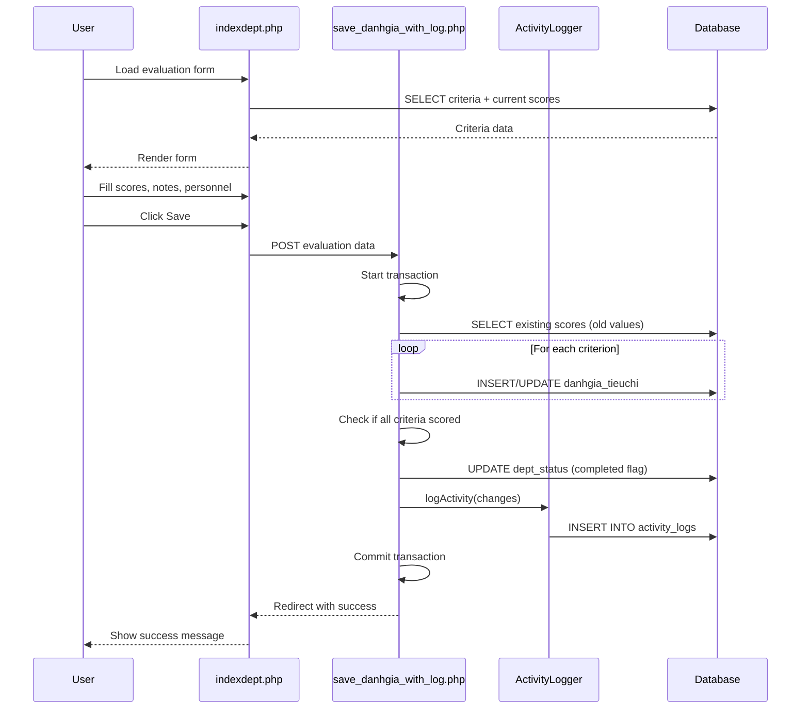
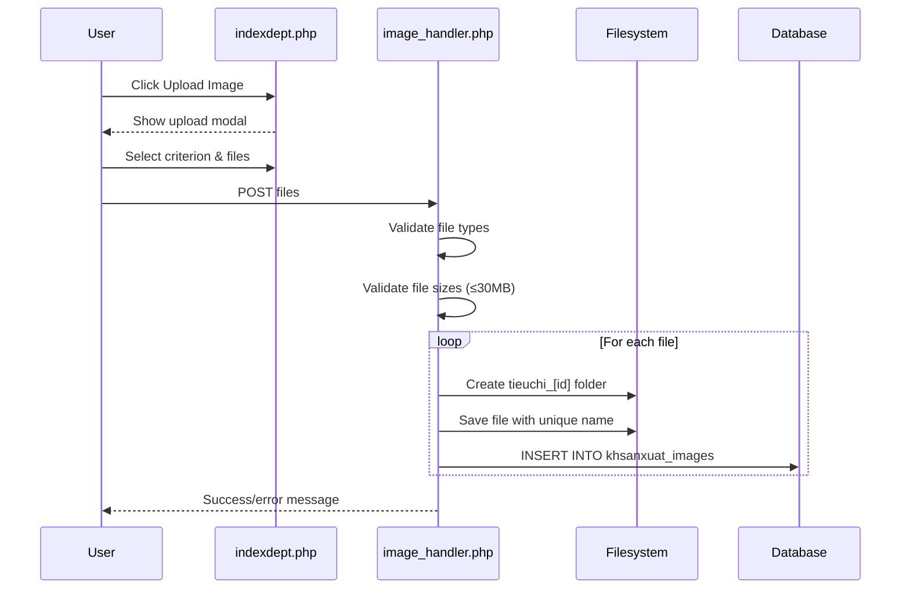
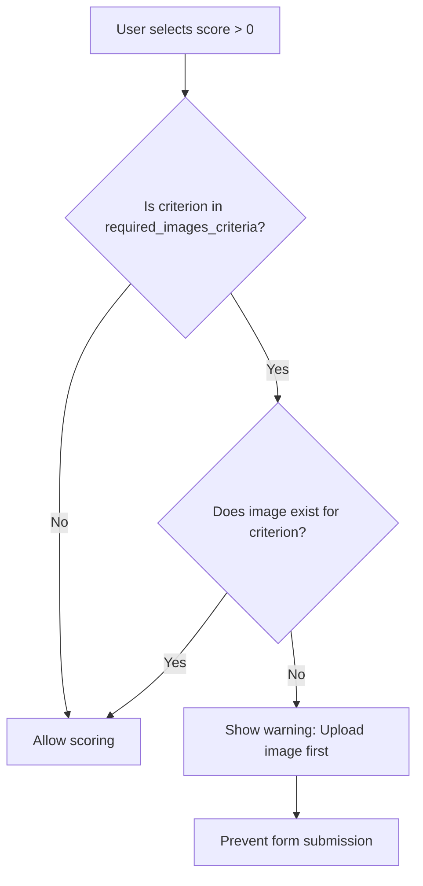

# Department Evaluation System - Design Specification

## Architecture Overview

The Department Evaluation System follows a traditional PHP multi-page application (MPA) architecture with server-side rendering, MySQL database, and session-based state management.

---

## System Components

### Entry Points
- `indexdept.php` - Main evaluation interface
- `save_danhgia_with_log.php` - Form submission handler with logging
- `save_danhgia.php` - Legacy form handler (without logging)
- `image_handler.php` - Image upload processor
- `incomplete_criteria.php` - Incomplete criteria report
- `manage_staff.php` - Staff CRUD API

### Supporting Modules
- `activity_logger.php` - Activity logging class
- `check_tieuchi_image.php` - Image validation helpers
- `db_connect.php` - Database connection
- `ajax_check_tieuchi_image.php` - AJAX image check endpoint

---

## Database Schema

### Core Tables

See database schema references at:
- `tieuchi_dept`: `khsanxuat_documentation.txt:67-72`
- `danhgia_tieuchi`: `he_thong_thong_tin.txt:72-82`
- `khsanxuat`: `khsanxuat_documentation.txt:57-65`

#### tieuchi_dept (Evaluation Criteria Master)

```sql
CREATE TABLE tieuchi_dept (
    id INT PRIMARY KEY AUTO_INCREMENT,
    dept VARCHAR(50) NOT NULL,        -- Department code
    noidung TEXT NOT NULL,             -- Criterion description
    thutu INT NOT NULL,                -- Display order
    nhom VARCHAR(100),                 -- Group name (optional)
    giai_thich TEXT,                   -- Explanation
    KEY idx_dept (dept),
    KEY idx_thutu (thutu)
);
```

**Reference**: `check_tieuchi.php:6-10`, `indexdept.php:713-727`

#### danhgia_tieuchi (Evaluation Records)

```sql
CREATE TABLE danhgia_tieuchi (
    id INT PRIMARY KEY AUTO_INCREMENT,
    id_sanxuat INT NOT NULL,           -- FK to khsanxuat.stt
    id_tieuchi INT NOT NULL,           -- FK to tieuchi_dept.id
    diem_danhgia DECIMAL(3,1),         -- Score: 0, 0.5, 1, 1.5, 3
    nguoi_thuchien INT,                -- FK to nhan_vien.id
    da_thuchien TINYINT(1) DEFAULT 0,  -- Completion flag
    ghichu TEXT,                       -- Notes
    han_xuly DATE,                     -- Deadline
    so_ngay_xuly INT,                  -- Processing days
    ngay_tinh_han VARCHAR(20),         -- Deadline calculation method
    KEY idx_sanxuat (id_sanxuat),
    KEY idx_tieuchi (id_tieuchi),
    UNIQUE KEY unique_eval (id_sanxuat, id_tieuchi)
);
```

**Reference**: `save_danhgia_with_log.php:148-220`, `he_thong_thong_tin.txt:72-82`

#### dept_status (Department Completion Status)

```sql
CREATE TABLE dept_status (
    id INT PRIMARY KEY AUTO_INCREMENT,
    id_sanxuat INT NOT NULL,
    dept VARCHAR(50) NOT NULL,
    completed TINYINT(1) DEFAULT 0,
    completed_date DATETIME,
    UNIQUE KEY unique_status (id_sanxuat, dept)
);
```

**Reference**: `save_danhgia.php:120-133`, `save_danhgia_with_log.php:320-326`

#### khsanxuat_images (Evidence Images)

```sql
CREATE TABLE khsanxuat_images (
    id INT PRIMARY KEY AUTO_INCREMENT,
    id_khsanxuat INT NOT NULL,
    dept VARCHAR(50) NOT NULL,
    image_path VARCHAR(255) NOT NULL,
    id_tieuchi INT NULL,               -- Criterion this image belongs to
    upload_date DATETIME DEFAULT CURRENT_TIMESTAMP,
    KEY idx_id_khsanxuat (id_khsanxuat),
    KEY idx_dept (dept),
    KEY idx_id_tieuchi (id_tieuchi)
);
```

**Reference**: `image_handler.php:338-352`

#### required_images_criteria (Image Requirements)

```sql
CREATE TABLE required_images_criteria (
    id INT PRIMARY KEY AUTO_INCREMENT,
    dept VARCHAR(50) NOT NULL,
    id_tieuchi INT NOT NULL,
    thutu INT NOT NULL,                -- Copy of criterion order
    noidung VARCHAR(255) NOT NULL,     -- Copy of criterion content
    created_at TIMESTAMP DEFAULT CURRENT_TIMESTAMP,
    UNIQUE KEY unique_dept_tieuchi (dept, id_tieuchi)
);
```

**Reference**: `manage_required_images.php:6-15`

#### activity_logs (Audit Trail)

```sql
CREATE TABLE activity_logs (
    id INT PRIMARY KEY AUTO_INCREMENT,
    user_name VARCHAR(50) NOT NULL,
    user_full_name VARCHAR(100) NOT NULL,
    action_type ENUM('update_score', 'update_person', 'update_note', 
                     'update_multiple', 'add_image', 'add_template', 
                     'delete_image', 'delete_template') NOT NULL,
    target_type ENUM('tieuchi', 'image', 'template') NOT NULL,
    target_id INT NOT NULL,
    id_khsanxuat INT NOT NULL,
    dept VARCHAR(50) NOT NULL,
    old_value TEXT NULL,
    new_value TEXT NULL,
    additional_info JSON,
    created_at TIMESTAMP DEFAULT CURRENT_TIMESTAMP,
    KEY idx_khsanxuat (id_khsanxuat),
    KEY idx_dept (dept),
    KEY idx_created_at (created_at)
);
```

**Reference**: `activity_logger.php:91-110`

#### nhan_vien (Staff/Personnel)

```sql
CREATE TABLE nhan_vien (
    id INT PRIMARY KEY AUTO_INCREMENT,
    ten VARCHAR(100) NOT NULL,         -- Name
    phong_ban VARCHAR(50) NOT NULL,    -- Department
    chuc_vu VARCHAR(100),              -- Position
    active TINYINT(1) DEFAULT 1,
    KEY idx_phong_ban (phong_ban)
);
```

**Reference**: `manage_staff.php:23-40`

---

## Business Logic

### Scoring System

**Standard Scoring**:
- `0` = Not completed
- `1` = Basic completion
- `3` = High quality completion

**Alternative Scoring** (for special criteria flagged with 999):
- `0` = Not completed
- `0.5` = Partial (50%)
- `1.5` = Partial (75%)

**Reference**: User-provided specification, scoring dropdown implementation

### Department Completion Calculation

```
Department is COMPLETE when:
  ALL criteria have diem_danhgia > 0

Department is INCOMPLETE when:
  ANY criterion has diem_danhgia = 0 OR diem_danhgia IS NULL
```

**Implementation**: `save_danhgia.php:38-50`

**Status Update Logic**:
```php
// Pseudo-code from save_danhgia.php:118-133
if (all_criteria_have_score_gt_0) {
    dept_status.completed = 1
    dept_status.completed_date = NOW()
} else {
    dept_status.completed = 0
    dept_status.completed_date = NULL
}
```

### Image Validation Rules

1. **File Format**: Only JPG, JPEG, PNG, GIF allowed
   - Reference: `image_handler.php:154`

2. **File Size**: Maximum 30MB (30,485,760 bytes)
   - Reference: `image_handler.php:152`

3. **Required Images**: If criterion exists in `required_images_criteria`:
   - Cannot score > 0 unless image exists for that criterion
   - Client-side validation on form submit
   - Server-side validation (if implemented)
   - Reference: `indexdept.php:259-272`, `indexdept.php:2622-2640`

4. **Storage Path**: `/uploads/[style]/dept_[dept]/tieuchi_[id_tieuchi]/`
   - Reference: `image_handler.php:162-169`

### Activity Logging Strategy

**Log Consolidation**:
When multiple criteria are updated in one form submission, all changes are consolidated into a single log entry with `action_type = 'update_multiple'`.

**Log Entry Structure**:
```json
{
  "action": "update_multiple",
  "status": "success",
  "changes": "Thay đổi điểm, người thực hiện, ghi chú",
  "changed_tieuchi": [
    {"id": 123, "name": "Criterion name", "changes": ["score", "person"]},
    {"id": 124, "name": "Another criterion", "changes": ["note"]}
  ],
  "dept_info": {
    "dept_code": "kehoach",
    "dept_name": "BỘ PHẬN KẾ HOẠCH"
  },
  "note": "Có 2 ghi chú được cập nhật",
  "note_entries": [...]
}
```

**Reference**: `save_danhgia_with_log.php:246-286`

**Individual Action Logging**:
- `update_score`: Score changed
- `update_person`: Responsible person changed
- `update_note`: Note changed
- `add_image`: Image uploaded
- `delete_image`: Image deleted

---

## Data Flow Diagrams

### Evaluation Submission Flow



### Image Upload Flow



### Required Image Validation Flow



**Reference**: `indexdept.php:2587-2640`

---

## File Organization

```
C:\xampp\htdocs\khsanxuat\
├── indexdept.php                   # Main evaluation UI
├── save_danhgia_with_log.php       # Save handler (with logging)
├── save_danhgia.php                # Legacy save handler
├── image_handler.php               # Image upload processor
├── incomplete_criteria.php         # Incomplete criteria report
├── manage_staff.php                # Staff management API
├── activity_logger.php             # Activity logging class
├── check_tieuchi_image.php         # Image validation helpers
├── ajax_check_tieuchi_image.php    # AJAX image check
├── db_connect.php                  # Database connection
├── required_images_criteria.php    # UI for managing required images
├── uploads/                        # Image storage
│   └── [style]/
│       └── dept_[dept]/
│           └── tieuchi_[id]/
│               └── [image files]
└── specs/
    └── department-evaluation/
        ├── requirements.md         # This spec
        ├── design.md               # Architecture (this file)
        └── tasks.md                # Implementation breakdown
```

---

## Security Considerations

### Current Implementation

1. **Session Management**: Uses PHP sessions for user tracking
   - Reference: `indexdept.php:22`, `activity_logger.php:17-88`

2. **SQL Injection Prevention**: Prepared statements used throughout
   - Reference: All database queries use `$stmt->bind_param()`

3. **File Upload Validation**:
   - Extension whitelist: jpg, jpeg, png, gif
   - Size limit: 30MB
   - Reference: `image_handler.php:152-156`

4. **Transaction Safety**: Database transactions ensure atomic operations
   - Reference: `save_danhgia_with_log.php:113-329`

### Known Limitations

- **Admin Check Disabled**: `$is_admin = true` hardcoded (line 30 of indexdept.php)
- **No CSRF Protection**: Forms lack CSRF tokens
- **No Input Sanitization**: HTML output uses raw values (XSS risk)
- **File Upload Path Traversal**: No validation of file paths

**Reference**: `indexdept.php:28-30`, `system_features_summary.md:631-633`

---

## Performance Optimization

### Database Indexes

Existing indexes on:
- `tieuchi_dept`: dept, thutu
- `danhgia_tieuchi`: id_sanxuat, id_tieuchi, unique(id_sanxuat, id_tieuchi)
- `khsanxuat_images`: id_khsanxuat, dept, id_tieuchi
- `activity_logs`: id_khsanxuat, dept, created_at
- `dept_status`: unique(id_sanxuat, dept)

### Query Optimization

**Criteria Loading**: Uses LEFT JOIN to fetch criteria with evaluation data in single query
```sql
SELECT tc.*, dg.nguoi_thuchien, dg.da_thuchien, dg.diem_danhgia, ...
FROM tieuchi_dept tc
LEFT JOIN danhgia_tieuchi dg ON tc.id = dg.id_tieuchi AND dg.id_sanxuat = ?
WHERE tc.dept = ?
ORDER BY CASE tc.nhom ... END, tc.thutu
```

**Reference**: `indexdept.php:713-727`

---

## Extension Points

### Adding New Departments

1. Add department code to `$dept_names` array in indexdept.php:33-44
2. Add criteria records to `tieuchi_dept` table for new dept
3. Update dept ordering in incomplete_criteria.php:109-125

### Adding New Score Values

1. Modify dropdown rendering in indexdept.php
2. Update `danhgia_tieuchi.diem_danhgia` column type if needed
3. Update completion calculation logic if 0 definition changes

### Adding New Activity Types

1. Add to ENUM in activity_logs table schema
2. Update ActivityLogger class action_type validation
3. Add logging calls in relevant handlers

---

## Dependencies

- **PHP**: ≥7.4 (uses type declarations, null coalescing)
- **MySQL**: ≥5.7 (uses JSON column type)
- **Extensions**: mysqli, session, file uploads enabled

---

## Implementation Notes

**Status**: Synced from existing implementation  
**Sync Date**: 2026-01-29

This design reflects the CURRENT state of the codebase. All diagrams, schemas, and logic descriptions are extracted from existing code, not planned features.
