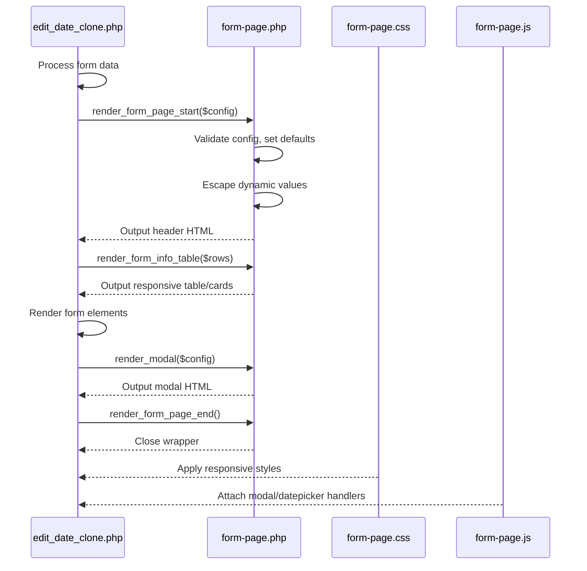
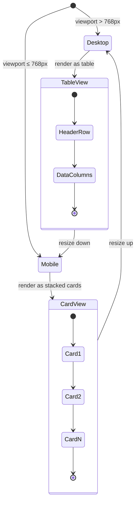
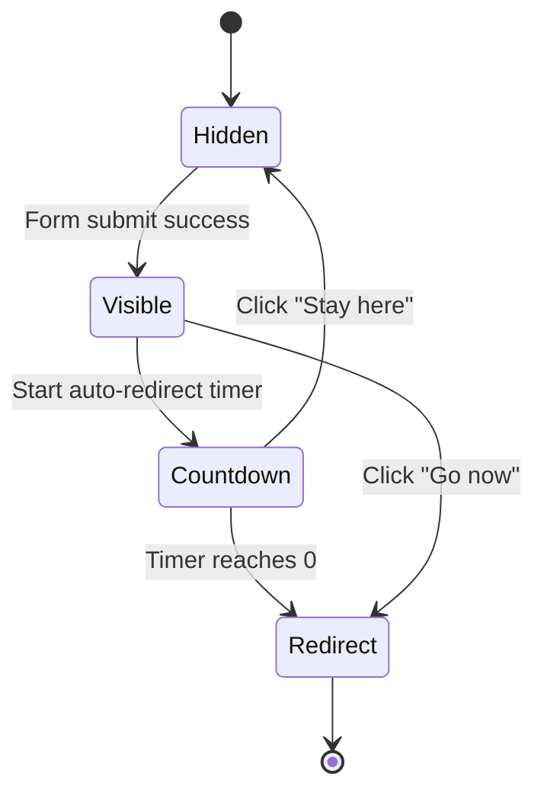

# Form Pages UI Standardization - Technical Design

## Architecture

PHP include-based component pattern matching `header.php`. Component wrapper class (`.form-page-component`) isolates styles. Mobile-first responsive design with 768px breakpoint.

### Directory Structure

```
khsanxuat/
├── assets/
│   ├── css/
│   │   ├── header.css              # Existing - header styles
│   │   └── form-page.css           # NEW - Form page styles (~400 lines)
│   └── js/
│       └── form-page.js            # NEW - Modal, datepicker helpers
├── components/
│   ├── header.php                  # Existing - header component
│   └── form-page.php               # NEW - Form page component
└── edit_date_clone.php             # MODIFY - First migration target
```

## Components

| Component | Responsibility | Location |
|-----------|---------------|----------|
| Form Page Component | Container, title, alerts, form wrapper | `components/form-page.php` |
| Form Page CSS | All form page styling with CSS variables | `assets/css/form-page.css` |
| Form Page JS | Modal controls, datepicker integration | `assets/js/form-page.js` |

## CSS Architecture

### CSS Variables

```css
:root {
    /* Primary Colors - Cyan Theme */
    --form-page-primary: #0891b2;           /* Cyan-600 */
    --form-page-primary-hover: #0e7490;     /* Cyan-700 */
    --form-page-primary-light: #ecfeff;     /* Cyan-50 */
    
    /* Secondary Colors - Slate Theme */
    --form-page-secondary: #334155;         /* Slate-700 */
    --form-page-secondary-light: #64748b;   /* Slate-500 */
    --form-page-text: #1e293b;              /* Slate-800 */
    --form-page-text-muted: #64748b;        /* Slate-500 */
    
    /* Background & Surface */
    --form-page-bg: #f8fafc;                /* Slate-50 */
    --form-page-card-bg: #ffffff;
    --form-page-border: #e2e8f0;            /* Slate-200 */
    
    /* Status Colors */
    --form-page-success: #10b981;           /* Emerald-500 */
    --form-page-error: #ef4444;             /* Red-500 */
    --form-page-warning: #f59e0b;           /* Amber-500 */
    --form-page-info: #0ea5e9;              /* Sky-500 */
    
    /* Typography */
    --form-page-font: 'Fira Sans', -apple-system, BlinkMacSystemFont, sans-serif;
    --form-page-font-size-base: 14px;
    --form-page-font-size-sm: 12px;
    --form-page-font-size-lg: 16px;
    --form-page-font-size-xl: 20px;
    
    /* Spacing */
    --form-page-spacing-xs: 4px;
    --form-page-spacing-sm: 8px;
    --form-page-spacing-md: 16px;
    --form-page-spacing-lg: 24px;
    --form-page-spacing-xl: 32px;
    
    /* Border Radius */
    --form-page-radius-sm: 4px;
    --form-page-radius-md: 8px;
    --form-page-radius-lg: 12px;
    
    /* Shadows */
    --form-page-shadow-sm: 0 1px 2px rgba(0,0,0,0.05);
    --form-page-shadow-md: 0 4px 6px rgba(0,0,0,0.1);
    --form-page-shadow-lg: 0 10px 15px rgba(0,0,0,0.1);
}
```

### CSS Class Naming Convention

```css
/* Wrapper prevents conflicts */
.form-page-component { }

/* Layout containers */
.form-page-component .form-page-container { }
.form-page-component .form-page-card { }
.form-page-component .form-page-header { }
.form-page-component .form-page-body { }
.form-page-component .form-page-footer { }

/* Form elements */
.form-page-component .form-group { }
.form-page-component .form-label { }
.form-page-component .form-input { }
.form-page-component .form-select { }
.form-page-component .form-textarea { }
.form-page-component .form-hint { }
.form-page-component .form-error { }

/* Buttons */
.form-page-component .btn-primary { }
.form-page-component .btn-secondary { }
.form-page-component .btn-danger { }

/* Info table / Card view */
.form-page-component .info-table { }
.form-page-component .info-card { }
.form-page-component .info-row { }
.form-page-component .info-label { }
.form-page-component .info-value { }

/* Alerts */
.form-page-component .alert { }
.form-page-component .alert-success { }
.form-page-component .alert-error { }
.form-page-component .alert-warning { }
.form-page-component .alert-info { }

/* Modal */
.form-page-component .modal-overlay { }
.form-page-component .modal-content { }
.form-page-component .modal-header { }
.form-page-component .modal-body { }
.form-page-component .modal-footer { }
```

### Responsive Breakpoints

| Breakpoint | Behavior |
|------------|----------|
| > 768px | Full card layout, side-by-side form groups, table view |
| ≤ 768px | Stacked layout, full-width inputs, card view for info |

## PHP API

### render_form_page_start($config)

Opens form page wrapper with optional header and alerts.

```php
/**
 * Render form page start wrapper
 * @param array $config Configuration array
 * @return void Outputs HTML directly
 */
function render_form_page_start($config) { }

// Configuration structure
$config = [
    'title' => 'Page Title',              // Required: Main page title
    'subtitle' => '',                      // Optional: Subtitle text
    'show_back_button' => true,            // Optional: Show back navigation (default: true)
    'back_url' => 'index.php',            // Optional: Back button URL (default: index.php)
    'alerts' => [                          // Optional: Alert messages
        ['type' => 'success', 'message' => 'Saved!'],
        ['type' => 'error', 'message' => 'Error occurred']
    ]
];

// Usage
render_form_page_start([
    'title' => 'Cập nhật ngày vào chuyền',
    'back_url' => 'index.php',
    'alerts' => $error ? [['type' => 'error', 'message' => $error]] : []
]);
```

### render_form_page_end()

Closes form page wrapper.

```php
/**
 * Render form page end wrapper
 * @return void Outputs HTML directly
 */
function render_form_page_end() { }

// Usage
render_form_page_end();
```

### render_form_input($config)

Renders a form input element with label and validation states.

```php
/**
 * Render form input element
 * @param array $config Configuration array
 * @return void Outputs HTML directly
 */
function render_form_input($config) { }

// Configuration structure
$config = [
    'type' => 'text',                     // Required: input type (text, number, date, email, etc.)
    'name' => 'field_name',               // Required: input name attribute
    'id' => 'field_id',                   // Optional: input id (defaults to name)
    'label' => 'Field Label',             // Required: label text
    'value' => '',                        // Optional: current value
    'placeholder' => '',                  // Optional: placeholder text
    'required' => false,                  // Optional: required field (default: false)
    'disabled' => false,                  // Optional: disabled state (default: false)
    'readonly' => false,                  // Optional: readonly state (default: false)
    'min' => null,                        // Optional: min value for number/date
    'max' => null,                        // Optional: max value for number/date
    'step' => null,                       // Optional: step for number inputs
    'hint' => '',                         // Optional: helper text below input
    'error' => '',                        // Optional: error message
    'class' => '',                        // Optional: additional CSS classes
    'wrapper_class' => '',                // Optional: wrapper div classes
    'attributes' => []                    // Optional: additional HTML attributes
];

// Usage examples
render_form_input([
    'type' => 'text',
    'name' => 'date_display',
    'label' => 'Ngày vào mới (Ngày/Tháng/Năm)',
    'value' => date('d/m/Y', strtotime($item_data['ngayin'])),
    'placeholder' => 'DD/MM/YYYY',
    'required' => true,
    'class' => 'date-picker'
]);

render_form_input([
    'type' => 'number',
    'name' => 'new_qty',
    'label' => 'Số lượng mới',
    'value' => $item_data['qty'],
    'min' => 1,
    'step' => 1,
    'required' => true
]);

render_form_input([
    'type' => 'number',
    'name' => 'new_line',
    'label' => 'Line mới (1-10)',
    'value' => $item_data['line1'],
    'min' => 1,
    'max' => 10,
    'step' => 1,
    'required' => true,
    'hint' => 'Nhập số từ 1 đến 10'
]);
```

### render_form_info_table($config)

Renders info table that transforms to cards on mobile.

```php
/**
 * Render responsive info table/card
 * @param array $config Configuration array
 * @return void Outputs HTML directly
 */
function render_form_info_table($config) { }

// Configuration structure
$config = [
    'rows' => [                           // Required: array of row data
        ['label' => 'STT', 'value' => $item_data['stt']],
        ['label' => 'Xưởng', 'value' => $item_data['xuong']],
        ['label' => 'Line', 'value' => $item_data['line1']],
        ['label' => 'PO', 'value' => $item_data['po']],
        ['label' => 'Style', 'value' => $item_data['style']],
        ['label' => 'Số lượng', 'value' => number_format($item_data['qty'])],
        ['label' => 'Ngày Vào', 'value' => date('d/m/Y', strtotime($item_data['ngayin'])), 'class' => 'date-format'],
        ['label' => 'Ngày Ra', 'value' => date('d/m/Y', strtotime($item_data['ngayout'])), 'class' => 'date-format']
    ],
    'class' => '',                        // Optional: additional wrapper classes
    'columns' => 2                        // Optional: number of columns on desktop (default: 2)
];

// Usage
render_form_info_table([
    'rows' => [
        ['label' => 'STT', 'value' => $item_data['stt']],
        ['label' => 'Xưởng', 'value' => $item_data['xuong']],
        // ...more rows
    ]
]);
```

### render_modal($config)

Renders a modal dialog.

```php
/**
 * Render modal dialog
 * @param array $config Configuration array
 * @return void Outputs HTML directly
 */
function render_modal($config) { }

// Configuration structure
$config = [
    'id' => 'modalId',                    // Required: unique modal ID
    'title' => 'Modal Title',             // Required: modal header title
    'body' => '',                         // Required: modal body HTML content
    'type' => 'default',                  // Optional: modal type (default, success, error, warning)
    'show_close' => true,                 // Optional: show X close button (default: true)
    'buttons' => [                        // Optional: footer buttons
        ['text' => 'Confirm', 'class' => 'btn-primary', 'id' => 'confirmBtn'],
        ['text' => 'Cancel', 'class' => 'btn-secondary', 'id' => 'cancelBtn', 'data-dismiss' => 'modal']
    ],
    'auto_redirect' => null,              // Optional: auto-redirect config
    'class' => ''                         // Optional: additional modal classes
];

// Auto-redirect configuration (for success modals)
$auto_redirect = [
    'url' => 'index.php',                 // Required: redirect URL
    'delay' => 3,                         // Optional: delay in seconds (default: 3)
    'show_countdown' => true              // Optional: show countdown (default: true)
];

// Usage example (success modal from edit_date_clone.php)
render_modal([
    'id' => 'successModal',
    'title' => 'Cập nhật thành công',
    'type' => 'success',
    'body' => '<p>Đã cập nhật ngày thành công!</p>',
    'auto_redirect' => [
        'url' => 'index.php',
        'delay' => 3,
        'show_countdown' => true
    ],
    'buttons' => [
        ['text' => 'Về trang chủ ngay', 'class' => 'btn-primary', 'id' => 'redirectNow'],
        ['text' => 'Ở lại trang này', 'class' => 'btn-secondary', 'id' => 'stayHere']
    ]
]);
```

### render_form_note($config)

Renders an info/note box.

```php
/**
 * Render form note/info box
 * @param array $config Configuration array
 * @return void Outputs HTML directly
 */
function render_form_note($config) { }

// Configuration structure
$config = [
    'type' => 'info',                     // Required: note type (info, warning, tip)
    'title' => 'Lưu ý:',                  // Optional: note title
    'items' => [                          // Required: list of note items
        'Ngày ra sẽ điều chỉnh theo cùng khoảng thời gian với ngày vào',
        'Số lượng phải là số nguyên dương',
        'Line từ 1 đến 10'
    ],
    'footer' => ''                        // Optional: footer text
];
```

## Data Models

### Form Page Configuration

| Property | Type | Required | Default | Description |
|----------|------|----------|---------|-------------|
| `title` | string | Yes | - | Page title |
| `subtitle` | string | No | `''` | Subtitle text |
| `show_back_button` | boolean | No | `true` | Show back navigation |
| `back_url` | string | No | `'index.php'` | Back button URL |
| `alerts` | array | No | `[]` | Alert messages |

### Form Input Configuration

| Property | Type | Required | Default | Description |
|----------|------|----------|---------|-------------|
| `type` | string | Yes | - | HTML input type |
| `name` | string | Yes | - | Input name attribute |
| `id` | string | No | name value | Input ID |
| `label` | string | Yes | - | Label text |
| `value` | mixed | No | `''` | Current value |
| `placeholder` | string | No | `''` | Placeholder text |
| `required` | boolean | No | `false` | Required field |
| `disabled` | boolean | No | `false` | Disabled state |
| `min` | number | No | `null` | Min value |
| `max` | number | No | `null` | Max value |
| `hint` | string | No | `''` | Helper text |
| `error` | string | No | `''` | Error message |

### Modal Configuration

| Property | Type | Required | Default | Description |
|----------|------|----------|---------|-------------|
| `id` | string | Yes | - | Unique modal ID |
| `title` | string | Yes | - | Modal header title |
| `body` | string | Yes | - | Modal body HTML |
| `type` | string | No | `'default'` | Modal type |
| `show_close` | boolean | No | `true` | Show close button |
| `buttons` | array | No | `[]` | Footer buttons |
| `auto_redirect` | array | No | `null` | Auto-redirect config |

## Key Flows

### Form Page Rendering Flow



### Mobile Info Table Transformation



### Modal Interaction Flow



## Migration Mapping

### edit_date_clone.php TODO Resolution

| TODO ID | Current Code | New Implementation |
|---------|--------------|-------------------|
| form-pages-ui-19 | `include 'db_connect.php'` | Add `include 'components/form-page.php'` |
| form-pages-ui-20 | `<link rel="stylesheet" href="style.css">` | Add `<link rel="stylesheet" href="assets/css/form-page.css">` |
| form-pages-ui-21 | `<div class="container">` | `render_form_page_start(['title' => 'Cập nhật ngày'])` |
| form-pages-ui-22 | Static `<table class="info-table">` | `render_form_info_table($rows)` |
| form-pages-ui-23 | Inline `style="..."` on inputs | CSS classes `.form-input`, `.date-input-container` |
| form-pages-ui-24 | Custom modal HTML | `render_modal($config)` |

### Before/After Code Comparison

**Before (inline styles):**
```html
<div class="date-input-container" style="position: relative; display: inline-block; width: 43%;">
    <input type="text" id="date_input" ... style="width: 100%; padding: 8px 35px 8px 8px; ...">
</div>
```

**After (CSS classes):**
```php
render_form_input([
    'type' => 'text',
    'name' => 'date_display',
    'id' => 'date_input',
    'label' => 'Ngày vào mới (Ngày/Tháng/Năm)',
    'value' => date('d/m/Y', strtotime($item_data['ngayin'])),
    'class' => 'date-picker',
    'wrapper_class' => 'date-input-container'
]);
```

## Error Handling

| Error Case | Response |
|------------|----------|
| Missing required `title` param | Display "Untitled Page" with PHP warning |
| Invalid input configuration | Skip invalid field, log warning |
| CSS file not found | Page renders unstyled (graceful degradation) |
| JS file not found | Modal non-functional, form still submits |
| XSS attempt in values | Escaped via htmlspecialchars() |

## Files Affected

| File | Change Type | Effort |
|------|-------------|--------|
| `components/form-page.php` | NEW | High |
| `assets/css/form-page.css` | NEW | High |
| `assets/js/form-page.js` | NEW | Medium |
| `edit_date_clone.php` | MODIFY | High (pilot) |

## Implementation Phases

### Phase 1: Foundation (4-6h) - Stories 3, 4

- Create `assets/css/form-page.css` with CSS variables and responsive styles
- Create `assets/js/form-page.js` for modal and datepicker integration
- Create `components/form-page.php` with all render functions

**Checkpoint**: Component files exist and are syntactically valid

### Phase 2: edit_date_clone.php Migration (3-4h) - Stories 1, 2, 6

- Include form-page component
- Replace container with `render_form_page_start()`
- Replace info table with `render_form_info_table()`
- Replace inline styles with CSS classes
- Replace modal with `render_modal()`
- Resolve all 6 TODO markers

**Checkpoint**: edit_date_clone.php works identically with component

### Phase 3: Testing & Polish (2-3h)

- Test at 320px, 768px, 1024px, 1440px viewports
- Verify datepicker functionality preserved
- Verify modal countdown and redirect works
- Test form validation and submission
- Accessibility audit

**Checkpoint**: All acceptance criteria verified

## Test Strategy

### Unit Testing

- Verify each render function outputs valid HTML
- Verify config validation and defaults
- Verify XSS protection on dynamic values

### Integration Testing

- Page loads without PHP errors
- Page loads without JS console errors
- Form submission works correctly
- Modal displays on success
- Auto-redirect functions

### Visual Testing

- Cyan/Slate theme colors applied correctly
- Responsive breakpoint at 768px works
- Info table transforms to cards on mobile
- Inputs have proper spacing and sizing
- Modal overlay and content styled correctly

### Accessibility Testing

- All inputs have associated labels
- Keyboard navigation works
- Focus states visible
- Color contrast passes WCAG AA
- Screen reader announces form elements

## Estimated Effort

| Phase | Hours | Risk |
|-------|-------|------|
| Phase 1: Foundation | 4-6h | Medium |
| Phase 2: Migration | 3-4h | HIGH |
| Phase 3: Testing | 2-3h | Low |
| **Total** | **9-13h** | **Medium** |
