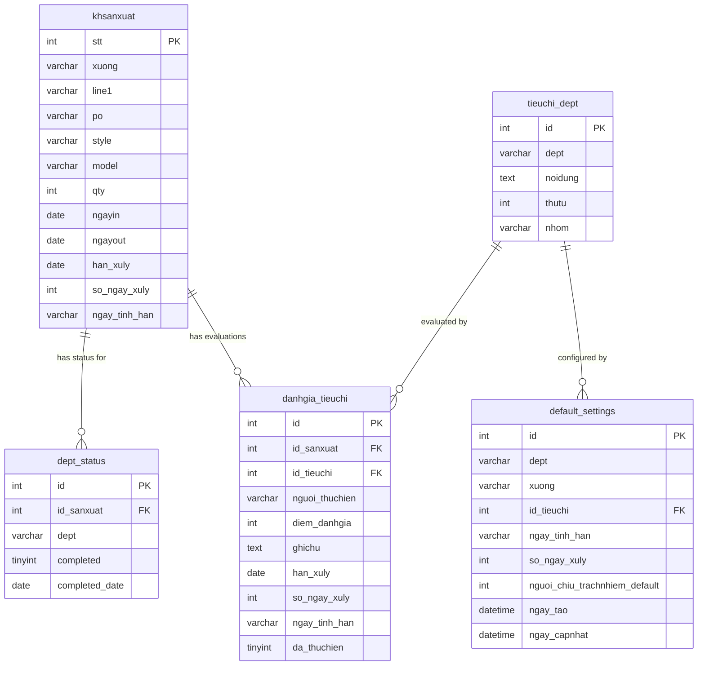
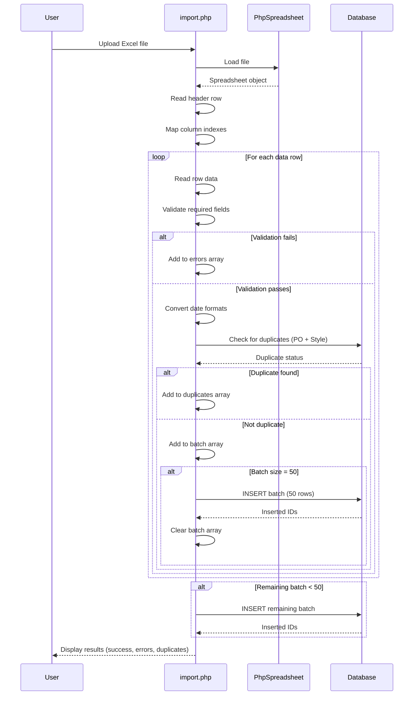
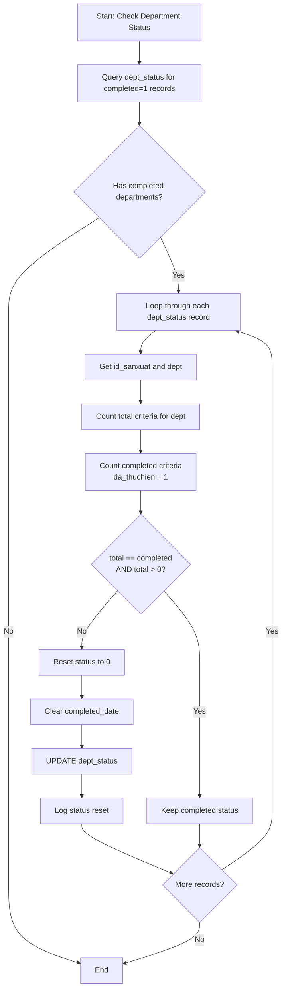
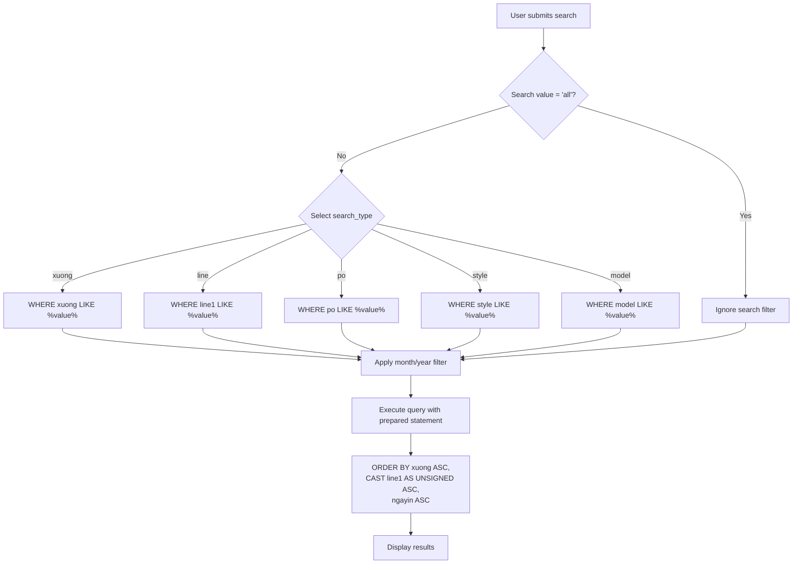

# Order & Production Tracking - Design

## Architecture Overview

The Order & Production Tracking feature is built as a server-rendered PHP application with direct database interaction through MySQLi. The system follows a traditional MVC-like pattern where PHP files handle both routing and view rendering.

### Core Components

| Component | File | Responsibility |
|-----------|------|---------------|
| Dashboard | `index.php` | Main order listing, search, month filtering |
| Import Handler | `import.php` | Excel upload, parsing, validation, batch insert |
| Export Handler | `export.php` | Excel generation with PhpSpreadsheet |
| Date Editor | `edit_date.php` | Order date updates and deadline recalculation |
| Status Checker | `check_completion_status.php` | Completion verification and status sync |
| Database Connection | `contdb.php` / `db_connect.php` | MySQLi connection management |

## Database Schema

### ER Diagram



### Field Descriptions

#### khsanxuat (Production Orders)

**Reference**: See `khsanxuat_documentation.txt:57-66`, `system_features_summary.md:83-95`

| Field | Type | Null | Description | Example |
|-------|------|------|-------------|---------|
| stt | INT | No | Auto-increment primary key | 1, 2, 3 |
| xuong | VARCHAR | No | Factory name | "Factory A", "Factory B" |
| line1 | VARCHAR | No | Production line identifier | "1", "2", "3A" |
| po | VARCHAR | No | Purchase order number | "PO-2024-001" |
| style | VARCHAR | No | Product style code | "ST-001", "SHIRT-01" |
| model | VARCHAR | Yes | Product model name | "Model X", "Type A" |
| qty | INT | No | Order quantity | 1000, 500 |
| ngayin | DATE | No | Entry/start date | 2024-01-15 |
| ngayout | DATE | Yes | Exit/completion date | 2024-02-15 |
| han_xuly | DATE | Yes | Processing deadline (deprecated, use criteria-level) | |
| so_ngay_xuly | INT | Yes | Default processing days | 7, 14 |
| ngay_tinh_han | VARCHAR(30) | Yes | Deadline calculation method | ngay_vao, ngay_ra |

**Indexes**:
- PRIMARY KEY (`stt`)
- INDEX on `ngayin` (for monthly filtering)
- Composite search optimization on (`xuong`, `line1`, `po`, `style`, `model`)

#### dept_status (Department Completion Status)

**Reference**: See `khsanxuat_documentation.txt:82-88`, `system_features_summary.md:96-102`

| Field | Type | Null | Description |
|-------|------|------|-------------|
| id | INT | No | Auto-increment primary key |
| id_sanxuat | INT | No | Foreign key to khsanxuat.stt |
| dept | VARCHAR | No | Department code (kehoach, kho, cat, etc.) |
| completed | TINYINT | No | Completion flag (0 = no, 1 = yes) |
| completed_date | DATE | Yes | Date all criteria were completed |

**Indexes**:
- PRIMARY KEY (`id`)
- INDEX on (`id_sanxuat`, `dept`) for fast status lookups

**Department codes** (all 13 departments supported in backend):
```
kehoach, kho, cat, ep_keo, chuanbi_sanxuat_phong_kt, may, 
hoan_thanh, co_dien, kcs, ui_thanh_pham, chuyen_may, 
quan_ly_sx, quan_ly_cl
```

**Dashboard visibility**: Only 4 departments currently visible on main dashboard (kehoach, chuanbi_sanxuat_phong_kt, kho, cat). See `index.php:2392-2884` for implementation.

#### default_settings (Deadline Configuration)

**Reference**: See `indexdept.php:174-186`, `migrate_settings.php:19-30`

| Field | Type | Null | Default | Description |
|-------|------|------|---------|-------------|
| id | INT | No | AUTO_INCREMENT | Primary key |
| dept | VARCHAR(50) | No | | Department code |
| xuong | VARCHAR(50) | No | '' | Factory name (empty = applies to all) |
| id_tieuchi | INT | No | | Foreign key to tieuchi_dept.id |
| ngay_tinh_han | VARCHAR(30) | No | 'ngay_vao' | Calculation method |
| so_ngay_xuly | INT | No | 7 | Processing days |
| nguoi_chiu_trachnhiem_default | INT | Yes | NULL | Default responsible person |
| ngay_tao | DATETIME | No | CURRENT_TIMESTAMP | Creation time |
| ngay_capnhat | DATETIME | No | ON UPDATE | Last update time |

**Unique constraint**: `(dept, id_tieuchi, xuong)`

## Data Flow Diagrams

### Excel Import Flow



**Implementation reference**: `import.php:506-676`

### Deadline Calculation Methods

**Reference**: `edit_date.php:23-98`

The system supports four deadline calculation methods configured in `default_settings.ngay_tinh_han`:

#### Method 1: ngay_vao (Entry Date Minus Days)

```
deadline = ngayin - so_ngay_xuly days
Example: ngayin = 2024-01-15, so_ngay_xuly = 7
Result: 2024-01-08 (deadline is 7 days before entry)
```

**Use case**: Tasks that must be completed before production starts (e.g., material preparation)

#### Method 2: ngay_vao_cong (Entry Date Plus Days)

```
deadline = ngayin + so_ngay_xuly days
Example: ngayin = 2024-01-15, so_ngay_xuly = 7
Result: 2024-01-22 (deadline is 7 days after entry)
```

**Use case**: Tasks with fixed duration from production start (e.g., first inspection)

#### Method 3: ngay_ra (Exit Date)

```
deadline = ngayout (if available)
         OR ngayin + 7 days (fallback)
Example: ngayout = 2024-02-15
Result: 2024-02-15
```

**Use case**: Tasks that must finish by production completion date

#### Method 4: ngay_ra_tru (Exit Date Minus Days)

```
deadline = ngayout - so_ngay_xuly days (if ngayout available)
         OR (ngayin + 7 days) - so_ngay_xuly days (fallback)
Example: ngayout = 2024-02-15, so_ngay_xuly = 3
Result: 2024-02-12 (3 days before exit)
```

**Use case**: Tasks that must complete before final deadline (e.g., final QC)

**Fallback logic**: When `ngayout` is empty and calculation requires it, the system uses `ngayin + 7 days` as a default exit date estimate.

### Completion Status Calculation

**Reference**: `check_completion_status.php:4-30`



**Logic**:
1. Find all departments marked as completed (`dept_status.completed = 1`)
2. For each, verify that ALL criteria in `tieuchi_dept` have matching evaluations with `da_thuchien = 1`
3. If any criterion is incomplete, reset `dept_status.completed = 0` and clear completion date
4. This ensures status accuracy when criteria are added, removed, or status is changed

### Search and Filter Flow

**Reference**: `index.php:61-105`



**SQL pattern**:
```sql
SELECT * FROM khsanxuat 
WHERE MONTH(ngayin) = ? 
  AND YEAR(ngayin) = ?
  AND {search_field} LIKE ?
ORDER BY xuong ASC, CAST(line1 AS UNSIGNED) ASC, ngayin ASC
```

**Note**: Line sorting uses `CAST(line1 AS UNSIGNED)` to achieve numeric ordering (1, 2, 10) instead of alphabetic (1, 10, 2).

## Integration Points

### Excel Processing

**Library**: PhpSpreadsheet (loaded via `vendor/autoload.php`)

**Import column mapping** (`import.php:530-548`):
- Supports case-insensitive header matching
- Required columns: LINE, xuong, PO, style, qty, ngayin, ngayout
- Optional columns: model

**Export structure** (`export.php:187-212`):
- Order data columns (A-H): STT, xuong, LINE, PO, style, model, qty, In, Out
- Department columns (I-U): 13 department status indicators
- Formatting: Header row with styling, data rows with conditional formatting

### Date Handling

**Date format conversion** (`import.php:8-31`):

```php
// Supports two input formats:
// 1. Excel serial number (numeric)
//    Example: 44927 → 2024-01-15
// 2. d/m/Y string format
//    Example: "15/01/2024" → 2024-01-15

function formatDate($date) {
    if (is_numeric($date)) {
        // Excel serial: days since 1900-01-01
        $unix_date = ($date - 25569) * 86400;
        return date('Y-m-d', $unix_date);
    }
    
    // Manual format: d/m/Y
    $parts = explode('/', $date);
    return sprintf('%04d-%02d-%02d', $parts[2], $parts[1], $parts[0]);
}
```

**Storage format**: All dates stored as `DATE` type in Y-m-d format (MySQL standard)

### Duplicate Detection

**Reference**: `import.php:321-328`

**Algorithm**:
```sql
SELECT stt FROM khsanxuat 
WHERE po = ? AND style = ?
LIMIT 1
```

**Business logic**: A record is duplicate if both PO number AND style code match an existing record. This prevents re-importing the same order while allowing different styles under the same PO.

## Performance Considerations

### Batch Processing

**Strategy**: Import processes 50 rows at a time to balance memory usage and database round trips.

**Configuration** (`import.php:512-516`):
```php
$batch_size = 50;
set_time_limit(300); // 5 minutes for large files
```

**Rationale**: Inserting rows one-by-one is slow for large datasets; inserting all at once risks memory exhaustion and long transactions. Batch size of 50 provides good balance.

### Query Optimization

**Monthly filtering**: Uses `MONTH(ngayin)` and `YEAR(ngayin)` functions. For better performance with large datasets, consider adding a computed column or index on `(YEAR(ngayin), MONTH(ngayin))`.

**Line sorting**: `CAST(line1 AS UNSIGNED)` enables numeric sorting but prevents index usage. For large datasets, consider storing line number as separate INT field.

**Search pattern**: LIKE with leading wildcard (`%value%`) cannot use indexes efficiently. Consider full-text search for style/model fields if dataset grows large.

## Security Considerations

**SQL Injection Prevention**: All queries use prepared statements with parameter binding (`mysqli::prepare`, `bind_param`).

**File Upload Validation**: 
- Excel files processed through PhpSpreadsheet library (validates file format)
- Time limit set to prevent DoS via extremely large files

**Input Sanitization**:
- Search values escaped through prepared statement parameters
- HTML output escaped with `htmlspecialchars()` in views

## Error Handling

**Import errors** (`import.php:509-510`):
- Validation errors collected in `$errors` array
- Duplicate records collected in `$duplicates` array
- Success records tracked in `$success` array
- All arrays displayed to user after import completes

**Date calculation errors** (`edit_date.php:33-47`):
- Try-catch around DateTime object creation
- Returns null if date is invalid
- Fallback to default values when dates unavailable

**Completion status errors** (`check_completion_status.php:63-66`):
- Exceptions logged to `completion_check.log` file
- Status changes also logged for audit trail

## Technology Stack

| Layer | Technology |
|-------|------------|
| Backend | PHP 7.4+ |
| Database | MySQL 5.7+ / MariaDB 10.3+ |
| Database Driver | MySQLi (procedural + object-oriented) |
| Excel Processing | PhpSpreadsheet 1.x |
| Frontend | Server-rendered HTML + CSS + vanilla JavaScript |
| Session Management | PHP native sessions |

## File Organization

```
C:\xampp\htdocs\khsanxuat\
├── index.php                    # Main dashboard
├── import.php                   # Excel import handler
├── export.php                   # Excel export handler
├── edit_date.php                # Date editor with deadline recalc
├── check_completion_status.php  # Status verification script
├── contdb.php                   # Database connection
├── db_connect.php               # Alternative DB connection
├── vendor/                      # Composer dependencies
│   └── autoload.php            # PhpSpreadsheet loader
└── specs/                       # This specification
    └── order-production-tracking/
        ├── requirements.md
        └── design.md
```
