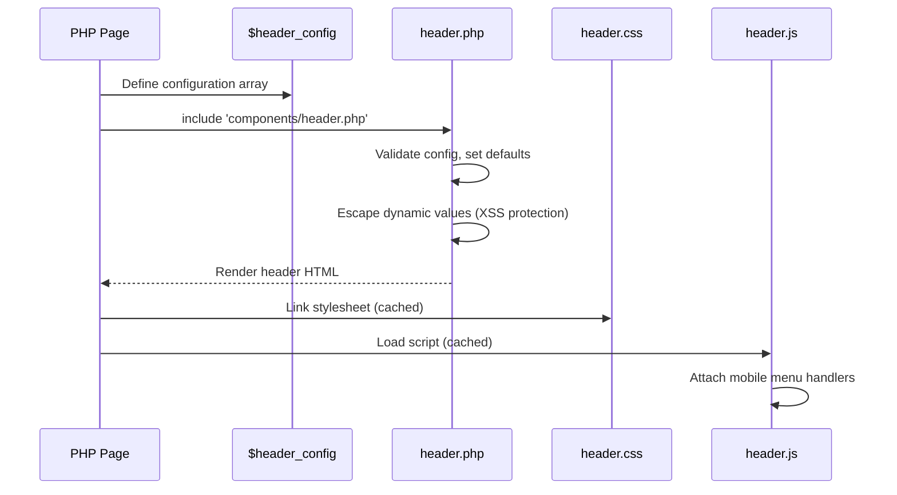
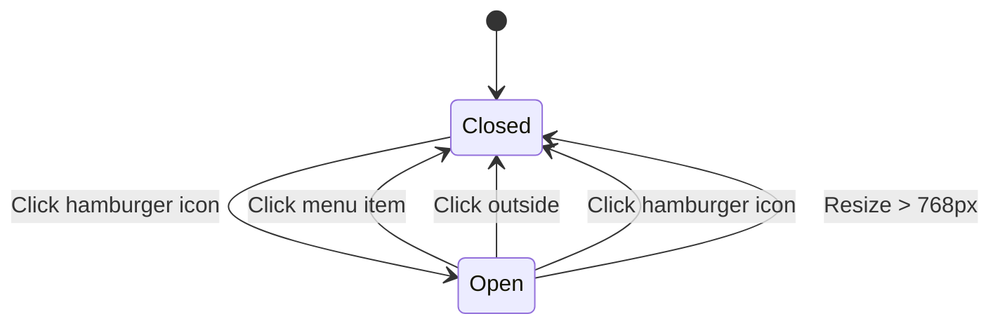

# Shared Header Component - Technical Design

## Architecture

PHP include-based component pattern with external CSS/JS files for caching. No framework dependencies.

### Directory Structure

```
khsanxuat/
├── assets/
│   ├── css/
│   │   └── header.css          # NEW - Extracted header styles (~2100 lines)
│   └── js/
│       └── header.js           # NEW - Mobile menu JavaScript
├── components/
│   └── header.php              # NEW - Reusable header component
└── [16 PHP files]              # MODIFY - Use component via include
```

## Components

| Component | Responsibility | Location |
|-----------|---------------|----------|
| Header Component | Renders header HTML with config params | `components/header.php` |
| Header CSS | All header/navbar styling | `assets/css/header.css` |
| Header JS | Mobile menu toggle functionality | `assets/js/header.js` |

## Component API

```php
// Usage in any PHP page
$header_config = [
    'title' => 'Page Title',              // Required: Main page title
    'title_short' => 'Short',             // Optional: Mobile title
    'logo_link' => '/trangchu/',          // Optional: Logo href (default: /khsanxuat/index.php)
    'show_search' => true,                // Optional: Show date search form (default: false)
    'show_mobile_menu' => true,           // Optional: Show hamburger (default: true)
    'search_params' => [                  // Optional: Pre-fill search values
        'month' => $month,
        'year' => $year
    ],
    'actions' => [                        // Optional: Action buttons array
        [
            'icon' => 'img/thongke.png',  // Icon path
            'link' => 'page.php',         // Destination URL
            'title' => 'Tooltip Text'     // Hover title
        ],
    ]
];
include 'components/header.php';
```

## Key Flows

### Component Rendering Flow



### Mobile Menu Interaction



## Data Models

### Header Configuration Object

| Property | Type | Required | Default | Description |
|----------|------|----------|---------|-------------|
| `title` | string | Yes | - | Page title displayed in header |
| `title_short` | string | No | `title` | Short title for mobile |
| `logo_link` | string | No | `/khsanxuat/index.php` | Logo anchor href |
| `show_search` | boolean | No | `false` | Display date search form |
| `show_mobile_menu` | boolean | No | `true` | Display hamburger menu |
| `search_params` | array | No | `[]` | `month`, `year`, `search_value`, `search_type` values |
| `actions` | array | No | `[]` | Action button definitions |

### Action Button Object

| Property | Type | Required | Description |
|----------|------|----------|-------------|
| `icon` | string | Yes | Path to icon image |
| `link` | string | Yes | Destination URL |
| `title` | string | No | Tooltip text |

## CSS Architecture

### Naming Convention

```css
/* Wrapper class prevents conflicts with existing styles */
.header-component { }
.header-component .navbar { }
.header-component .navbar-brand { }
.header-component .nav-menu { }
.header-component .nav-item { }
.header-component .action-btn { }
.header-component .search-form { }
.header-component .mobile-toggle { }
```

### Color Variables

```css
:root {
    --header-primary: #003366;
    --header-primary-dark: #002244;
    --header-text: #ffffff;
    --header-hover: rgba(255,255,255,0.1);
}
```

### Responsive Breakpoints

| Breakpoint | Behavior |
|------------|----------|
| > 768px | Full horizontal navbar, all items visible |
| ≤ 768px | Hamburger menu, dropdown navigation |

## Files Affected

| File | Change Type | Effort |
|------|-------------|--------|
| `components/header.php` | NEW | High |
| `assets/css/header.css` | NEW | High |
| `assets/js/header.js` | NEW | Medium |
| `index.php` | MODIFY - Extract CSS/JS, use component | High (pilot) |
| `indexdept.php` | MODIFY | Medium |
| `indexdept1.php` | MODIFY | Medium |
| `dept_statistics.php` | MODIFY | Low |
| `dept_statistics_month.php` | MODIFY | Low |
| `danhgia_hethong.php` | MODIFY | Medium |
| `import.php` | MODIFY | Low |
| `file_templates.php` | MODIFY | Low |
| `factory_templates.php` | MODIFY | Medium |
| `theodoi.php` | MODIFY | Low |
| `image_handler.php` | MODIFY | Low |
| `image_handler_1.php` | MODIFY | Low |
| `image_handler_2.php` | MODIFY | Low |
| `incomplete_criteria.php` | MODIFY | Low |
| `required_images_criteria.php` | MODIFY | Low |
| `manage_required_images.php` | MODIFY | Low |

## Implementation Phases

### Phase 1: Foundation (4-6h) - Stories 1, 6
- Create `components/` directory
- Extract CSS from index.php to `assets/css/header.css`
- Extract JS to `assets/js/header.js`
- Create `components/header.php` with full API

**Checkpoint**: Component files exist and are syntactically valid

### Phase 2: Pilot Migration (3-4h) - Story 1, 2, 3
- Migrate `index.php` to use component
- Test all JavaScript functionality
- Test mobile menu
- Verify no regressions

**Checkpoint**: index.php works identically with component

### Phase 3: Simple Pages (2-3h) - Story 6
- `import.php`
- `file_templates.php`
- `theodoi.php`
- `dept_statistics.php`
- `dept_statistics_month.php`

**Checkpoint**: 6/16 pages migrated

### Phase 4: Department Pages (2-3h) - Story 4, 5
- `indexdept.php`
- `indexdept1.php`
- `danhgia_hethong.php`
- `factory_templates.php`

**Checkpoint**: 10/16 pages migrated

### Phase 5: Image Handler Pages (2-3h)
- `image_handler.php`
- `image_handler_1.php`
- `image_handler_2.php`

**Checkpoint**: 13/16 pages migrated

### Phase 6: Remaining Pages (1-2h)
- `incomplete_criteria.php`
- `required_images_criteria.php`
- `manage_required_images.php`

**Checkpoint**: 16/16 pages migrated

### Phase 7: Cleanup (1-2h)
- Remove dead inline CSS/JS
- Verify all pages
- Document usage

**Checkpoint**: All cleanup complete, documentation updated

## Error Handling

| Error Case | Response |
|------------|----------|
| Missing required `title` param | Display "Untitled Page" with PHP warning |
| Invalid `actions` array format | Skip invalid actions, render valid ones |
| CSS file not found | Header renders unstyled (graceful degradation) |
| JS file not found | Mobile menu non-functional, links still work |

## Risk Mitigation

| Risk | Severity | Mitigation |
|------|----------|------------|
| Breaking JavaScript in index.php | HIGH | Preserve exact DOM structure and element IDs |
| CSS specificity conflicts | HIGH | Use `.header-component` wrapper for all styles |
| Missing mobile menu on pages | MEDIUM | Test each page at 767px width |
| Breaking search functionality | MEDIUM | Pass search_params correctly, test form submission |
| Logo link inconsistency | LOW | Default to index.php, allow override |

## Test Strategy

### Unit Testing
- Verify component renders with minimal config
- Verify all config options are respected
- Verify XSS protection on dynamic values

### Integration Testing
- Each page loads without PHP errors
- Each page loads without JS console errors
- Mobile menu works on each page
- Search form submits correctly (where applicable)

### Visual Testing
- Header color is #003366 on all pages
- Header height/sizing consistent
- Mobile menu appears at correct breakpoint
- Action buttons display correctly

## Red Flags Found in Current Codebase

| Issue | Location | Impact |
|-------|----------|--------|
| 2100+ lines inline CSS | `index.php` | Unmaintainable, no caching |
| Inconsistent navbar colors | Various pages | Poor UX |
| 15/16 pages missing mobile menu | All except index.php | Mobile users cannot navigate |
| Inconsistent logo links | Various pages | Confusing navigation |
| Duplicate header HTML | All 16 pages | Change requires 16 edits |

## Estimated Effort

| Phase | Hours | Risk |
|-------|-------|------|
| Phase 1: Foundation | 4-6h | Medium |
| Phase 2: Pilot (index.php) | 3-4h | HIGH |
| Phase 3: Simple pages | 2-3h | Low |
| Phase 4: Department pages | 2-3h | Medium |
| Phase 5: Image handlers | 2-3h | Low |
| Phase 6: Remaining | 1-2h | Low |
| Phase 7: Cleanup | 1-2h | Low |
| **Total** | **15-23h** | **Medium** |
