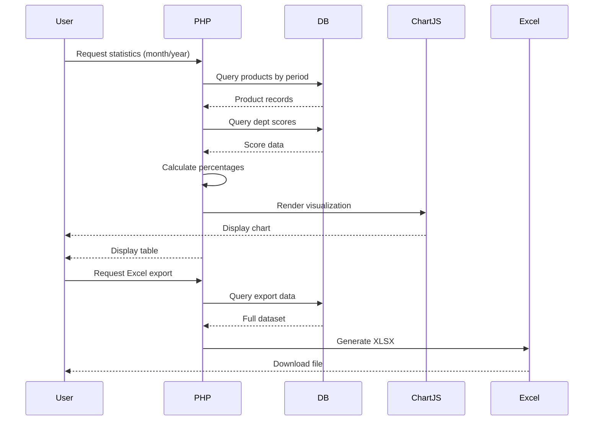

# Statistics & Reporting - Technical Design

## Architecture Overview

The statistics and reporting system consists of four main components:
1. **Daily Department Statistics** - Individual department performance tracking
2. **Monthly Aggregated Statistics** - Department comparison and trends
3. **System-Wide Evaluation** - Factory-level risk assessment
4. **Data Export** - Excel report generation

## Component Architecture

### 1. Daily Department Statistics
**Entry Point**: `dept_statistics.php:1-400`

**Flow**:
```
User Request (dept, month, year)
    ↓
Query completed products for department
    ↓
Calculate scores for each product
    ↓
Display product list with scores/percentages
```

**Score Calculation**: See `dept_statistics.php:64-81`

### 2. Monthly Aggregated Statistics
**Entry Point**: `dept_statistics_month.php:1-580`

**Flow**:
```
User Request (month, year)
    ↓
Fetch all products for month
    ↓
Check completion status per department
    ↓
Calculate average scores across products
    ↓
Generate department comparison table + risk assessment
```

**Aggregation Logic**: See `dept_statistics_month.php:85-128`

### 3. System-Wide Evaluation
**Entry Point**: `danhgia_hethong.php:1-259`

**Flow**:
```
User Request (product id_sanxuat)
    ↓
Fetch product details
    ↓
Calculate score for each of 10 departments
    ↓
Sum total score and assess risk level
    ↓
Display evaluation table with risk classification
```

**Risk Assessment**: See `danhgia_hethong.php:251-256`

### 4. Data Export
**Entry Point**: `export.php:109-346`

**Flow**:
```
User Request (month, year)
    ↓
Create PhpSpreadsheet instance
    ↓
Add headers and styling
    ↓
Query and populate product data
    ↓
Generate XLSX file
    ↓
Download to browser
```

**Export Template**: See `export.php:116-187`

## Score Calculation Formulas

### Department Score Calculation

**Formula**:
```
total_score = SUM(danhgia_tieuchi.diem_danhgia)
              WHERE id_sanxuat = ? AND dept = ?

total_criteria = COUNT(tieuchi_dept.id)
                 WHERE dept = ?

max_score = total_criteria * 3

percentage = (total_score / max_score) * 100
```

**Implementation**: `dept_statistics_month.php:48-64`

### Average Department Score (Monthly)

**Formula**:
```
avg_score = SUM(product_scores) / COUNT(completed_products)

avg_max_score = SUM(product_max_scores) / COUNT(completed_products)

avg_percent = (avg_score / avg_max_score) * 100
```

**Implementation**: `dept_statistics_month.php:98-115`

### Completion Rate

**Formula**:
```
completed_count = COUNT(products WHERE dept_status.completed = 1)

completion_rate = (completed_count / total_products) * 100
```

**Implementation**: `dept_statistics_month.php:86-96`

### System Risk Assessment

**Thresholds**:
```
total_score < 267       → High Risk (red)
267 ≤ total_score < 338 → Low Risk (orange)
339 ≤ total_score < 430 → Acceptable (yellow)
total_score ≥ 431       → Good (green)
```

**Implementation**: `danhgia_hethong.php:251-256` and `dept_statistics_month.php:146-148`

## Database Queries

### Monthly Products Query
```sql
SELECT kh.*
FROM khsanxuat kh
JOIN dept_status ds ON kh.stt = ds.id_sanxuat
WHERE MONTH(kh.ngayin) = ? AND YEAR(kh.ngayin) = ?
  AND ds.dept = ? AND ds.completed = 1
ORDER BY kh.ngayin ASC
```
**Location**: `dept_statistics.php:84-89`

### Department Score Query
```sql
SELECT SUM(dg.diem_danhgia) as total_score, 
       COUNT(tc.id) as total_criteria
FROM tieuchi_dept tc
LEFT JOIN danhgia_tieuchi dg 
  ON tc.id = dg.id_tieuchi AND dg.id_sanxuat = ?
WHERE tc.dept = ?
```
**Location**: `dept_statistics_month.php:49-52`

### Available Months Query
```sql
SELECT DISTINCT MONTH(ngayin) as month, YEAR(ngayin) as year
FROM khsanxuat
ORDER BY year DESC, month DESC
```
**Location**: `dept_statistics_month.php:131-133`

### System Evaluation Score Query
```sql
SELECT SUM(dg.diem_danhgia) as total_score
FROM danhgia_tieuchi dg
JOIN tieuchi_dept td ON dg.id_tieuchi = td.id
WHERE dg.id_sanxuat = ? AND td.dept = ?
```
**Location**: `danhgia_hethong.php:57-60`

## Visualization (Chart.js)

### Department Completion Bar Chart

**Chart Configuration**: `index.php:2892-2987`

**Chart Type**: Horizontal bar chart

**Data Structure**:
```javascript
{
  type: 'bar',
  data: {
    labels: ['Kế Hoạch', 'Chuẩn Bị SX', ...],
    datasets: [{
      label: 'Tỷ lệ hoàn thành (%)',
      data: [85, 92, 78, ...],
      backgroundColor: ['#FF6384', '#36A2EB', ...]
    }]
  }
}
```

**Interactive Features**:
- Hover tooltip shows percentage
- Click bar navigates to dept_statistics.php
- Responsive sizing for mobile (≤428px)

**Color Mapping**: Department-specific colors from `dept_colors` array

## Department Configuration

### Department Codes and Requirements

**Configuration**: `danhgia_hethong.php:7-17`

| Department | Code | Required Score |
|------------|------|----------------|
| Kế Hoạch | kehoach | 45 |
| Chuẩn Bị SX (Phòng KT) | chuanbi_sanxuat_phong_kt | 78 |
| Kho Nguyên, Phụ Liệu | kho | 96 |
| Cắt | cat | 27 |
| Ép Keo | ep_keo | 24 |
| Cơ Điện | co_dien | 33 |
| Chuyền May | chuyen_may | 39 |
| KCS | kcs | 36 |
| Ủi Thành Phẩm | ui_thanh_pham | 15 |
| Hoàn Thành | hoan_thanh | 45 |

**Total Required Score**: 438 points

### Department Color Scheme

Colors assigned for visual consistency across charts and tables (implementation-specific, see dept_colors array in runtime).

## Excel Export Structure

### File Format
**Format**: XLSX (Office Open XML)
**Library**: PhpSpreadsheet

### Spreadsheet Layout
**Row 1**: Company header (A1:V1 merged)
**Row 2**: Report title with month/year (A2:V2 merged)
**Row 3**: Column headers
**Row 4+**: Product data rows

### Column Structure (A-V)
See `export.php:190-204` for department column mappings:
- A-H: Product info (STT, Xưởng, Line, PO, Style, Qty, dates)
- I-U: Department status columns
- V: Overall status

### Styling
**Header Font**: Bold, Size 22, Center-aligned
**Data Cells**: Border, padding, conditional formatting for status
**File Naming**: `KH_RaiChuyen_ThangMM_NamYYYY_YYYYMMDD_HHMMSS.xlsx`

**Implementation**: `export.php:125-187`

## Data Flow Diagram



## Performance Considerations

### Calculation Optimization
- Scores calculated per-product to avoid N+1 queries
- Department completion checked in batch
- Monthly aggregates computed once per page load

### Database Indexing
Recommended indexes:
- `khsanxuat(ngayin)` for month/year filtering
- `dept_status(id_sanxuat, dept, completed)` for completion checks
- `danhgia_tieuchi(id_sanxuat, id_tieuchi)` for score joins

### Caching Strategy
No caching currently implemented. Statistics reflect real-time data.

## Error Handling

### Missing Data
- Null scores default to 0: `$data['total_score'] ?? 0`
- Division by zero protected: `$avg_max_score > 0 ? ... : 0`
- Missing departments handled with default colors

### Query Failures
Prepared statements used throughout for SQL injection protection.

**Example**: `dept_statistics.php:70-73`

## Responsive Design

### Mobile Breakpoints
- **≤428px**: Small phone
  - Chart title: 16px (vs 45px desktop)
  - Chart padding: 10px (vs 20px desktop)
  - Table font: 12-13px (vs default)

- **≤768px**: Tablet
  - Tables scroll horizontally
  - Navbar compact layout

**Implementation**: `dept_statistics.php:208-282`

## Integration Points

### Database Tables
- `khsanxuat` - Production records
- `danhgia_tieuchi` - Criterion evaluations
- `tieuchi_dept` - Department criteria definitions
- `dept_status` - Completion tracking

### External Libraries
- Chart.js (CDN) - Visualization
- PhpSpreadsheet (Composer) - Excel export

### Navigation
- Dashboard (index.php) → dept_statistics.php (click chart bar)
- dept_statistics_month.php → dept_statistics.php (click department link)
- Any page → export.php (export button)

## Security

### SQL Injection Prevention
All queries use prepared statements with parameter binding.

**Example**: `dept_statistics_month.php:54-56`

### Input Validation
- Month: Integer, 1-12 range
- Year: Integer, valid year
- Department code: Predefined set only
- Product ID: Integer, must exist

## Future Enhancements

Potential improvements identified from code:
1. Add caching for frequently accessed monthly stats
2. Implement real-time chart updates
3. Add PDF export option alongside Excel
4. Include trend analysis (month-over-month comparison)
5. Add department drill-down from monthly view

## References

**Key Implementation Files**:
- Score calculation: `dept_statistics_month.php:46-80`
- Chart configuration: `index.php:2892-2987`
- Risk assessment: `danhgia_hethong.php:251-256`
- Excel export: `export.php:109-346`
- Monthly aggregation: `dept_statistics_month.php:85-145`
